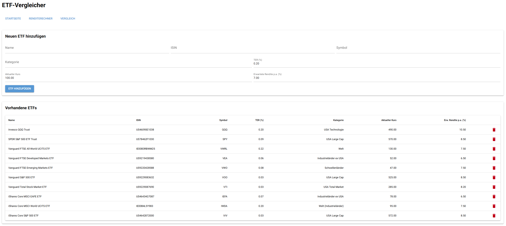
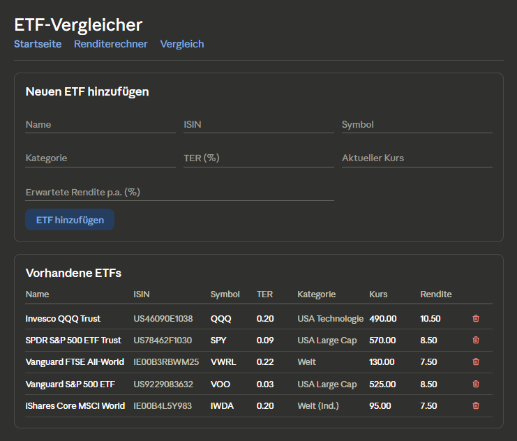
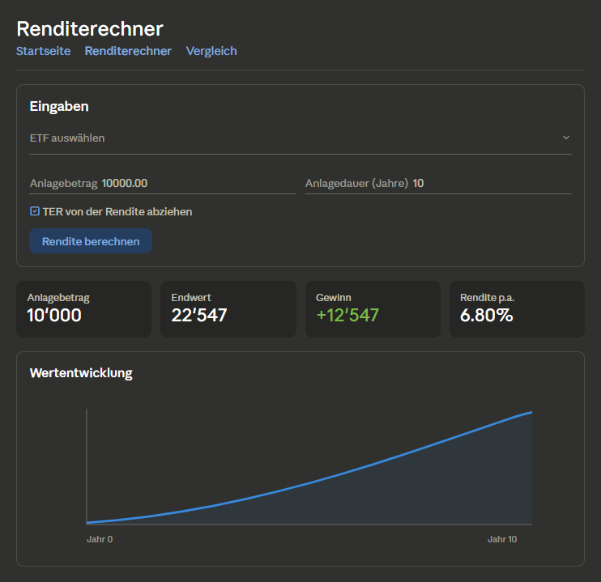
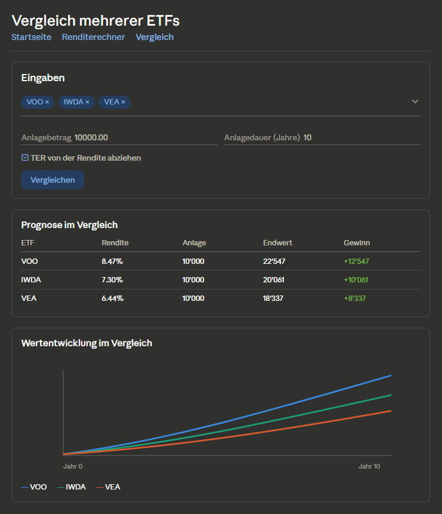
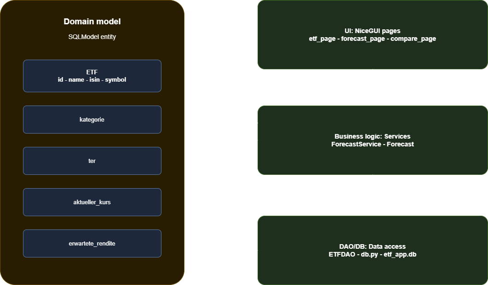
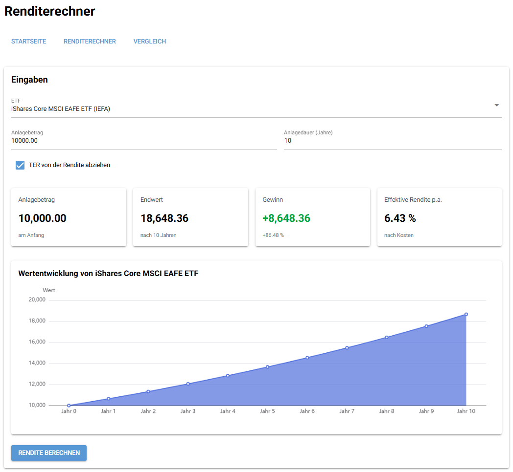

# 📈 ETF-Vergleicher – ETF Comparison Web App



---

This project demonstrates the development of a browser-based application using **NiceGUI**, focusing on clean architecture, data validation, and database integration via an ORM.

It aims to:

- Cover the full process from **requirements analysis to implementation**
- Apply advanced **Python** concepts in a web-based application
- Demonstrate **data validation**, layered architecture, and ORM usage
- Produce clean, maintainable, and well-tested code
- Support **teamwork and professional documentation**

---

## 📝 Application Requirements

### Problem

Private investors often lack simple tools to compare ETFs and project their future performance. Decisions are made based on gut feeling, without accounting for costs such as TER or the effect of compound interest over time.

---

### Scenario

The application allows users to:

- manage a personal list of ETFs (add / delete)
- view key ETF data in a clear overview table
- calculate a return forecast for a selected ETF (compound interest formula)
- compare multiple ETFs side by side in a table and chart
- validate all inputs before processing

---

## 📖 User Stories

### 1. Manage ETF List
**As a user, I want to add new ETFs and view or delete existing ones.**

- **Inputs:** name, ISIN, symbol, TER, category, current price, expected annual return
- **Outputs:** updated ETF list (`list[ETF]`)

---

### 2. View ETF Overview
**As a user, I want to see all saved ETFs in a clear table.**

- **Inputs:** none
- **Outputs:** table with all ETF data

---

### 3. Return Forecast (Renditerechner)
**As a user, I want to calculate the expected growth of a one-time investment in a selected ETF.**

- **Inputs:** ETF selection, investment amount (`float`), investment duration (`int`), TER deduction (`bool`)
- **Outputs:** final value, profit, effective return p.a., chart of annual values

---

### 4. ETF Comparison
**As a user, I want to compare multiple ETFs side by side.**

- **Inputs:** multiple ETF selection, investment amount (`float`), investment duration (`int`), TER deduction (`bool`)
- **Outputs:** comparison table and multi-line chart

---

## 🧩 Use Cases


### Main Use Cases
- Add ETF (User)
- Delete ETF (User)
- View ETF List (User)
- Calculate Return Forecast (User)
- Compare ETFs (User)

### Actors
- User

---

### Wireframes / Mockups

**Start Page:**



**Renditerechner:**



**Vergleich:**



---

## 🏛️ Architecture



### Layers
- **UI:** NiceGUI (browser-based interface) – three pages (`etf_page`, `forecast_page`, `compare_page`)
- **Application logic:** `ForecastService` for compound interest calculation
- **Persistence:** SQLite + SQLModel ORM + `ETFDAO` for data access

### Design Decisions
- Layered N-Tier structure as recommended by the course guidelines
- Clear separation of concerns: UI files do not contain business logic, services do not contain SQL
- Inputs validated in the model itself (Pydantic field rules) so invalid data cannot enter the system

### Design Patterns Used
- **Facade Pattern:** The `Database` class hides engine creation, schema setup, and seeding behind one simple interface. The rest of the app only calls `Database().init()`.
- **Data Access Object (DAO):** `ETFDAO` encapsulates all database operations. The UI calls methods like `list_all()` or `create()` and never sees any SQL.
- **Inheritance for DAOs:** `BaseDAO` holds the engine and a session helper. `ETFDAO` inherits from it – a clean OOP demo and extension point for future DAOs.

---

## 🗄️ Database and ORM

The application uses **SQLModel** to map domain objects to a SQLite database (`data/etf_app.db`). On first launch the database is automatically created and seeded with the **10 largest ETFs worldwide** by assets under management.

### Entities
- `ETF`

### Fields
| Field | Type | Description |
|---|---|---|
| `id` | `int` | Primary key (auto-generated) |
| `name` | `str` | Full name of the ETF (2–120 chars) |
| `isin` | `str` | Unique ISIN (exactly 12 chars) |
| `symbol` | `str` | Ticker symbol (e.g. `VWRL`) |
| `ter` | `float` | Total Expense Ratio in % (0 – 5) |
| `kategorie` | `str` | Category (e.g. `Welt`, `Schwellenländer`) |
| `aktueller_kurs` | `float` | Current price (>0) |
| `erwartete_rendite` | `float` | Expected annual return in % (-50 to 100) |

---

## ✅ Project Requirements

Each app must meet the following criteria from the official project guidelines:

1. Using NiceGUI for building an interactive web app
2. Data validation in the app
3. Using an ORM for database management

---

### 1. Browser-based App (NiceGUI)

The application runs entirely in the browser via NiceGUI. Users can:

- Add, view and delete ETFs on the start page
- Run return forecasts on the **Renditerechner** page
- Compare multiple ETFs with table and chart on the **Vergleich** page

**Architecture note (per SS26 guidelines):** the browser is a thin client; UI state and business logic live on the server-side NiceGUI app.

---

### 2. Data Validation

The application validates user input on three levels:

- **Model level (Pydantic):** the `Field(...)` rules on the `ETF` class reject empty names, prices ≤ 0, wrong ISIN length, and unrealistic TER or return values – before anything touches the database.
- **Service level:** `ForecastService.calculate()` rejects an investment amount ≤ 0 or fewer than 1 year.
- **UI level:** the pages catch validation errors and show a clear warning to the user (e.g. "Bitte einen ETF auswählen").

Additional integrity checks:
- Duplicate ISINs are rejected at the DAO via a typed `DuplicateISINError`
- At least 2 ETFs must be selected for the comparison

---

### 3. Database Management

All ETF data is stored and managed via **SQLModel** (an ORM based on SQLAlchemy). The `ETFDAO` class handles all CRUD operations; no other file contains raw SQL.

---

## ⚙️ Implementation

### Technology

- Python 3.10+
- NiceGUI
- SQLModel / SQLAlchemy
- pytest + pytest-cov

---

### 📚 Libraries Used

- **nicegui** – UI framework
- **sqlmodel** – ORM
- **sqlalchemy** – database toolkit (used internally by SQLModel)
- **pytest** – testing
- **pytest-cov** – test coverage report

---

## 📂 Repository Structure

```text
etf_vergleicher/
├── main.py                       # entry point – starts the NiceGUI app
├── pytest.ini
├── requirements.txt
├── data/
│   └── etf_app.db                # SQLite DB (created on first start)
├── etf_app/
│   ├── __init__.py
│   ├── domain/
│   │   ├── __init__.py
│   │   └── models.py             # ETF (SQLModel + Pydantic validation)
│   ├── data_access/
│   │   ├── __init__.py
│   │   ├── db.py                 # Database facade
│   │   ├── dao.py                # BaseDAO + ETFDAO
│   │   └── seed.py               # seeds the 10 largest ETFs
│   ├── services/
│   │   ├── __init__.py
│   │   └── forecast_service.py   # compound interest calculation
│   └── ui/
│       ├── __init__.py
│       ├── common.py             # shared navigation row
│       ├── etf_page.py           # start page (CRUD)
│       ├── forecast_page.py      # Renditerechner
│       └── compare_page.py       # comparison page
└── tests/
    ├── conftest.py
    ├── test_unit.py              # 6 unit tests (service logic)
    ├── test_db.py                # 5 DB tests (DAO + model validation)
    └── test_integration.py       # 4 integration tests (DAO + service)
```

---

### How to Run

### 1. Project Setup
- Python 3.10+ is required
- Create and activate a virtual environment:
   - **macOS/Linux:**
      ```bash
      python3 -m venv .venv
      source .venv/bin/activate
      ```
   - **Windows:**
      ```bash
      python -m venv .venv
      .venv\Scripts\Activate
      ```
- Install dependencies:
   ```bash
   pip install -r requirements.txt
   ```

### 2. Configuration

No additional configuration required. The SQLite database file (`data/etf_app.db`) is created and seeded with the 10 largest ETFs on first launch.

### 3. Launch

```bash
python main.py
```

Open the URL printed in the console (default: `http://localhost:8080`).

### 4. Usage

**Add an ETF:**
1. Open the start page
2. Fill in all fields (name, ISIN, symbol, TER, category, current price, expected return)
3. Click **ETF hinzufügen** – the ETF appears in the table below

**Delete an ETF:**
1. On the start page, click the red bin icon next to the ETF
2. Confirm in the dialog

**Calculate a forecast:**
1. Navigate to **Renditerechner**
2. Select an ETF, enter an investment amount and duration
3. Optionally enable/disable TER deduction
4. Click **Rendite berechnen** – KPI cards and a chart appear

**Compare ETFs:**
1. Navigate to **Vergleich**
2. Select at least 2 ETFs, enter an investment amount and duration
3. Click **Vergleichen** – a comparison table and multi-line chart appear

<table>
  <tr>
    <td align="center"><b>Start Page</b></td>
    <td align="center"><b>Renditerechner</b></td>
    <td align="center"><b>Vergleich</b></td>
  </tr>
  <tr>
    <td></td>
    <td></td>
    <td></td>
  </tr>
</table>

---

## 🧪 Testing

The project ships with **15 automated tests** in three categories, plus a separate document with **15 manual GUI test cases** for end-to-end checks in the browser.

### Automated tests (15)

| Category | File | Count | Examples |
|---|---|---|---|
| Unit tests | `tests/test_unit.py` | 6 | Compound interest with/without TER, zero return, negative effective rate, single-year forecast, invalid input rejection |
| DB tests | `tests/test_db.py` | 5 | `list_all()` returns saved ETFs, `create()` assigns id, duplicate ISIN raises typed exception, `delete()`, model validation rejects bad input |
| Integration | `tests/test_integration.py` | 4 | Save via DAO + find via list, forecast on a DB-loaded ETF, save then delete, forecast on multiple ETFs |

**Coverage:** ~85% on the testable layers (domain, data_access, services). UI pages are covered by manual GUI tests.

**Run all tests:**
```bash
pytest
```

**Run with coverage report:**
```bash
pytest --cov=etf_app
```

### Manual GUI tests (15)

The 15 manual test cases live in [`docs/test_cases.md`](docs/test_cases.md). Each follows the template:

1. Preconditions
2. Test steps
3. Test data / input
4. Expected result
5. Actual result
6. Status (pass / fail)
7. Comments

---

## 👥 Team & Contributions

| Name | Contribution |
|---|---|
| Mateo | NiceGUI UI + documentation |
| Janis | Database & ORM + documentation |
| Cyril | Business logic & tests + documentation |

---

## 📝 License

This project is provided for **educational use only** as part of the Advanced Programming module.
